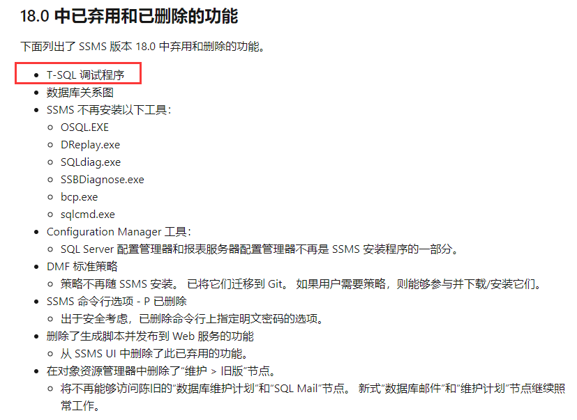

```plsql
USE [DEVELOP]
GO

/****** Object:  UserDefinedFunction [dbo].[f_str2date]    Script Date: 2020/12/30 12:29:48 ******/
SET ANSI_NULLS ON
GO

SET QUOTED_IDENTIFIER ON
GO


-- =============================================
-- Author:		Fun
-- Create date: 2020-12-29 22:46
-- Description: String to date
-- Usage:
--		SELECT [dbo].[F_str2date](NULL,NULL);  运行结果：传参错误！
--		SELECT [dbo].[F_str2date]('20201230121314',null);  运行结果：2020年12月30日 12时13分14秒
--		SELECT [dbo].[F_str2date]('20201230121314','-');  运行结果：2020-12-30 12:13:14
-- =============================================
CREATE FUNCTION [dbo].[f_str2date] (@P_STRING VARCHAR(14),
                                   @P_Split  VARCHAR(12))
RETURNS VARCHAR(MAX)
AS
  BEGIN
      DECLARE @RESULT VARCHAR(27) = '';
      DECLARE @P_Date VARCHAR(22);
      DECLARE @P_Time VARCHAR(22) = '';
      DECLARE @P_Delimiter VARCHAR(22);

      IF @P_STRING IS NULL
        BEGIN
            SET @RESULT = '传参错误！';
        END
      ELSE
        BEGIN
            IF @P_Split IS NULL
              BEGIN
                  SET @P_Delimiter = '年月日时分秒';

                  IF Len(@P_STRING) >= 8
                    SELECT @P_Date = Concat(Concat(Concat(Substring(@P_STRING, 1, 4), Substring(@P_Delimiter, 1, 1)), Concat(Substring(@P_STRING, 5, 2), Substring(@P_Delimiter, 2, 1))), Concat(Substring(@P_STRING, 7, 2), Substring(@P_Delimiter, 3, 1)));

                  IF Len(@P_STRING) >= 12
                    SELECT @P_Time = Concat(Substring(@P_STRING, 9, 2), Substring(@P_Delimiter, 4, 1))
                                     + Concat(Substring(@P_STRING, 11, 2), Substring(@P_Delimiter, 5, 1));

                  IF Len(@P_STRING) >= 14
                    SELECT @P_Time = @P_Time
                                     + Concat(Substring(@P_STRING, 13, 2), Substring(@P_Delimiter, 6, 1));

                  SET @RESULT=@P_Date + ' ' + @P_Time;
              END
            ELSE
              BEGIN
                  SET @P_Delimiter = @P_Split;

                  IF Len(@P_STRING) >= 8
                    SELECT @P_Date = Concat(Concat(Concat(Substring(@P_STRING, 1, 4), @P_Delimiter), Concat(Substring(@P_STRING, 5, 2), @P_Delimiter)), Substring(@P_STRING, 7, 2));

                  IF Len(@P_STRING) >= 12
                    SELECT @P_Time = Concat(Substring(@P_STRING, 9, 2), ':')
                                     + Substring(@P_STRING, 11, 2);

                  IF Len(@P_STRING) >= 14
                    SELECT @P_Time = @P_Time
                                     + Concat(':', Substring(@P_STRING, 13, 2));

                  SET @RESULT=@P_Date + ' ' + @P_Time;

              END
        END

      RETURN Isnull(@RESULT, @P_STRING);
  END 
GO


```

第一次在SqlServer平台写函数，花了很多时间，遇到了不少坑：

1、每个`IF……ELSE……`后面都要写`BEGIN+END`，很恶心，没有Oracle 平台语法简单；

2、变量赋值超出长度不会报错，超出的内容会进行截断不输出，对于第一次在SqlServer平台写程序的人很不友好，不容易排错；

3、建议新手不要使用 SQL Server Management Studio (SSMS) 18.0（包含）之后的版本，官方移除了DEBUG功能。

https://docs.microsoft.com/zh-CN/sql/ssms/release-notes-ssms?view=sql-server-ver15#180



